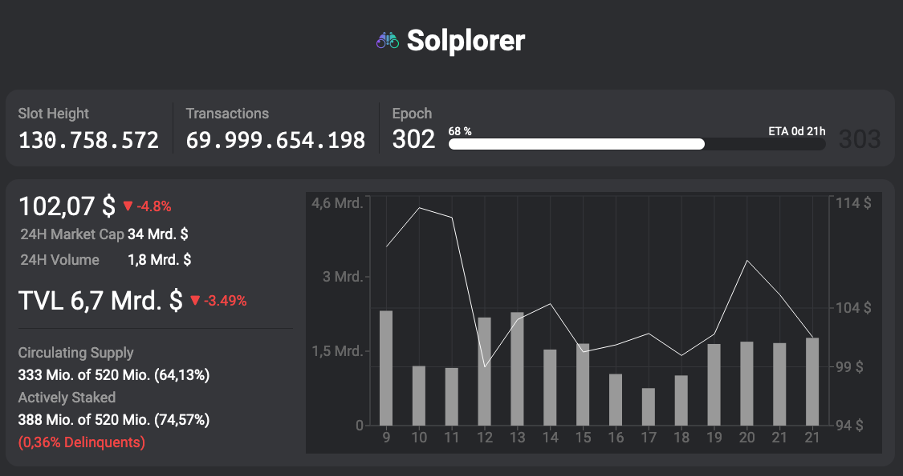

# Solplorer
An independent and open-source (GPLv3) explorer for [Solana Blockchain](https://solana.com)



This program is non-production, pre-Alpha experimental PoC, and the code a little messy, yet.

## Why?

All useable explorers for Solana are either built and / or backed by Validators, or people / companies with other commercial interests, or the Solana Foundation itself.

I'm not saying this is bad per se (I eventually stake my SOL with them, too), but

**I felt an independent and open-source alternative is needed**.

## Contributing

Ideas, bugs or questions? [Create an issue](issues).

### Developing

Solplorer is built with React, using NextJS.

0. If you haven't already, get Git and NodeJS and install dependencies with
    ```sh
    npm install
    ```
1. To get validators data, run
    ```sh
    npm run data
    ```
    *This will take around 5min, currently!*

2. The usual
    ```sh
    npm run dev # lint / build / start
    ```
